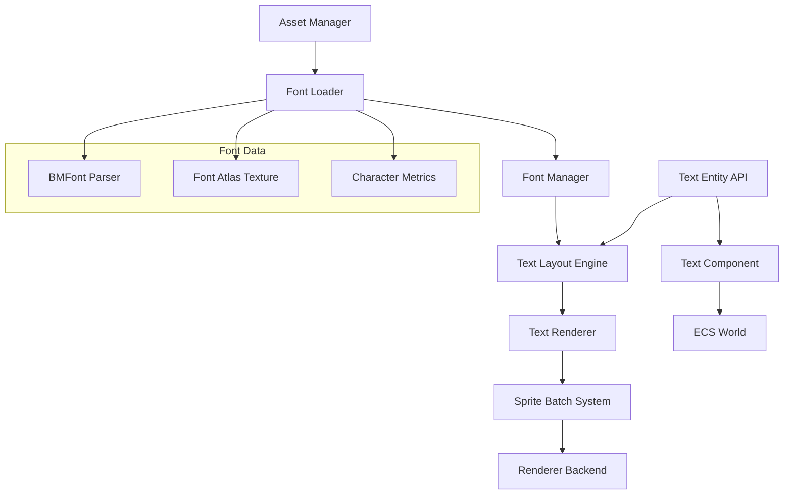

# Text Rendering System Design Document

## Overview

The Text Rendering System provides comprehensive bitmap font rendering capabilities for the 2D web game engine. The system integrates with the existing ECS architecture while providing specialized APIs for text-specific operations like layout, wrapping, and styling. The design emphasizes performance through efficient batching, flexibility through comprehensive styling options, and compatibility with both WebGL2 and Canvas 2D rendering backends.

## Architecture

The text rendering system consists of several interconnected components:



### Core Subsystems

1. **Font Management**: Loading, parsing, and caching bitmap fonts
2. **Text Layout**: Calculating character positions, line breaks, and alignment
3. **Text Rendering**: Converting layout data to renderable sprites
4. **ECS Integration**: Components and systems for text entities
5. **Asset Integration**: Font loading through the existing asset pipeline

## Components and Interfaces

### Font Management

```typescript
interface BitmapFont {
  readonly id: string;
  readonly atlas: Texture;
  readonly lineHeight: number;
  readonly baseline: number;
  readonly characters: Map<string, CharacterData>;
  readonly kerningPairs: Map<string, number>;
}

interface CharacterData {
  readonly char: string;
  readonly x: number;
  readonly y: number;
  readonly width: number;
  readonly height: number;
  readonly xOffset: number;
  readonly yOffset: number;
  readonly xAdvance: number;
}

interface FontManager {
  loadFont(descriptor: FontDescriptor): Promise<BitmapFont>;
  getFont(id: string): BitmapFont | undefined;
  releaseFont(id: string): void;
}
```

### Text Layout Engine

```typescript
interface TextLayoutOptions {
  font: BitmapFont;
  text: string;
  maxWidth?: number;
  horizontalAlign: 'left' | 'center' | 'right';
  verticalAlign: 'top' | 'middle' | 'bottom';
  lineHeight?: number;
  characterSpacing?: number;
  wordWrap: boolean;
}

interface LayoutResult {
  characters: CharacterLayout[];
  bounds: TextBounds;
  lineCount: number;
}

interface CharacterLayout {
  char: string;
  x: number;
  y: number;
  data: CharacterData;
}

interface TextBounds {
  x: number;
  y: number;
  width: number;
  height: number;
}
```

### Text Entity Components

```typescript
interface TextComponent {
  readonly type: 'TextComponent';
  text: string;
  fontId: string;
  color: [number, number, number, number];
  maxWidth?: number;
  horizontalAlign: 'left' | 'center' | 'right';
  verticalAlign: 'top' | 'middle' | 'bottom';
  lineHeight?: number;
  characterSpacing?: number;
  wordWrap: boolean;
  dropShadow?: DropShadowStyle;
  stroke?: StrokeStyle;
  visible: boolean;
}

interface DropShadowStyle {
  color: [number, number, number, number];
  offsetX: number;
  offsetY: number;
}

interface StrokeStyle {
  color: [number, number, number, number];
  width: number;
}

interface TextLayoutComponent {
  readonly type: 'TextLayoutComponent';
  layout: LayoutResult | null;
  dirty: boolean;
}
```

### Text Rendering API

```typescript
interface TextRenderer {
  createTextEntity(world: World, options: TextEntityOptions): Entity;
  updateText(world: World, entity: Entity, text: string): void;
  updateStyle(world: World, entity: Entity, style: Partial<TextStyle>): void;
  measureText(font: BitmapFont, text: string, options?: MeasureOptions): TextBounds;
  render(world: World, renderer: Renderer): void;
}

interface TextEntityOptions {
  text: string;
  font: string;
  x: number;
  y: number;
  style?: Partial<TextStyle>;
}

interface TextStyle {
  color: [number, number, number, number];
  maxWidth?: number;
  horizontalAlign: 'left' | 'center' | 'right';
  verticalAlign: 'top' | 'middle' | 'bottom';
  lineHeight?: number;
  characterSpacing?: number;
  wordWrap: boolean;
  dropShadow?: DropShadowStyle;
  stroke?: StrokeStyle;
}
```

## Data Models

### BMFont Format Support

The system supports the AngelCode BMFont format with the following structure:

```
font.fnt (descriptor file)
font_0.png (texture atlas page 0)
font_1.png (texture atlas page 1, if needed)
```

The .fnt file contains:

- Font info (size, padding, spacing)
- Common metrics (line height, baseline)
- Character definitions (position, size, offsets, advance)
- Kerning pairs (character pair spacing adjustments)

### Font Asset Descriptor

```typescript
interface FontDescriptor {
  key: string;
  fntFile: string;
  textureFiles: string[];
  loader: 'bmfont';
}
```

### Layout Algorithm Data Structures

```typescript
interface LineLayout {
  characters: CharacterLayout[];
  width: number;
  height: number;
  baseline: number;
}

interface LayoutState {
  lines: LineLayout[];
  currentLine: CharacterLayout[];
  currentWidth: number;
  maxWidth: number;
  wordWrap: boolean;
}
```

## Correctness Properties

_A property is a characteristic or behavior that should hold true across all valid executions of a system-essentially, a formal statement about what the system should do. Properties serve as the bridge between human-readable specifications and machine-verifiable correctness guarantees._

Now I need to complete the prework analysis before writing the correctness properties:

<function_calls>
<invoke name="prework">
<parameter name="featureName">text-rendering-system

### Property Reflection

After reviewing all properties identified in the prework analysis, I've identified several areas where properties can be consolidated to eliminate redundancy:

**Font Loading Properties (1.1, 1.2):** These can be combined into a single comprehensive font parsing property that covers both BMFont format parsing and data extraction.

**Alignment Properties (4.1-4.6):** All six alignment properties follow the same pattern and can be consolidated into two comprehensive properties - one for horizontal alignment and one for vertical alignment.

**Measurement Properties (8.1, 8.2, 8.3):** These three properties all relate to text measurement and can be combined into a single bounds calculation property.

**Serialization Properties (10.1, 10.2, 10.3):** Properties 10.1 and 10.3 are subsumed by the round-trip property 10.2, which validates complete serialization/deserialization correctness.

**Spacing Properties (6.1, 6.2, 6.5):** Properties 6.1 and 6.2 can be combined into a single spacing application property, with 6.5 being a separate update property.

The remaining properties provide unique validation value and should be retained as individual properties.

### Correctness Properties

Property 1: Font parsing completeness
_For any_ valid BMFont format file, parsing should successfully extract all character data, kerning information, and font metrics without data loss
**Validates: Requirements 1.1, 1.2**

Property 2: Font loading error handling
_For any_ invalid or corrupted font format data, the loading process should reject the operation and provide clear error information
**Validates: Requirements 1.3**

Property 3: Font resource isolation
_For any_ set of loaded fonts, each font should be managed independently without resource conflicts or cross-contamination
**Validates: Requirements 1.4**

Property 4: Font atlas validation
_For any_ font atlas texture and associated metadata, all referenced characters should exist within the texture bounds
**Validates: Requirements 1.5**

Property 5: Text content updates trigger layout recalculation
_For any_ text entity with updated content, the layout should be recalculated and rendering data should reflect the new content
**Validates: Requirements 2.2**

Property 6: Unsupported character handling
_For any_ text content containing unsupported characters, the system should substitute with fallback characters or skip rendering without errors
**Validates: Requirements 2.4**

Property 7: Text entity independence
_For any_ set of text entities, each entity should maintain separate state without interference from other entities
**Validates: Requirements 2.5**

Property 8: Word boundary wrapping
_For any_ text that exceeds the specified wrap width, line breaks should occur at appropriate word boundaries when possible
**Validates: Requirements 3.1**

Property 9: Character boundary wrapping
_For any_ single word that exceeds the wrap width, the word should be broken at character boundaries
**Validates: Requirements 3.2**

Property 10: Single line rendering when wrapping disabled
_For any_ text with wrapping disabled, all content should render on a single line regardless of width
**Validates: Requirements 3.3**

Property 11: Layout recalculation on width changes
_For any_ text with changed wrap width, line breaks should be recalculated immediately to reflect the new width
**Validates: Requirements 3.4**

Property 12: Manual line break preservation
_For any_ text containing explicit line breaks, those breaks should be preserved in addition to automatic wrapping
**Validates: Requirements 3.5**

Property 13: Horizontal alignment positioning
_For any_ text with specified horizontal alignment, character positions should align correctly (left edges for left, centers for center, right edges for right) relative to the anchor point
**Validates: Requirements 4.1, 4.2, 4.3**

Property 14: Vertical alignment positioning
_For any_ text with specified vertical alignment, line positions should align correctly (top edges for top, centers for middle, bottom edges for bottom) relative to the anchor point
**Validates: Requirements 4.4, 4.5, 4.6**

Property 15: Text color application
_For any_ text with specified color, all rendered characters should display with the specified color values
**Validates: Requirements 5.1**

Property 16: Drop shadow rendering
_For any_ text with drop shadow enabled, a shadow copy should be rendered at the specified offset from the main text
**Validates: Requirements 5.2**

Property 17: Stroke outline rendering
_For any_ text with stroke outline enabled, an outline should be rendered around each character with the specified properties
**Validates: Requirements 5.3**

Property 18: Style effect layering order
_For any_ text with multiple styling effects applied, the effects should render in the correct layering order (shadow, outline, main text)
**Validates: Requirements 5.4**

Property 19: Immediate style updates
_For any_ text with updated styling properties, the changes should be applied to the rendered output immediately
**Validates: Requirements 5.5**

Property 20: Spacing application
_For any_ text with specified line height or character spacing, the spacing should be applied consistently across all lines and characters
**Validates: Requirements 6.1, 6.2**

Property 21: Kerning adjustment application
_For any_ text using a font with kerning data, kerning adjustments should be applied between appropriate character pairs
**Validates: Requirements 6.3**

Property 22: Negative spacing handling
_For any_ text with negative spacing values, spacing should be reduced while maintaining character readability
**Validates: Requirements 6.4**

Property 23: Position recalculation on spacing changes
_For any_ text with changed spacing values, all character positions should be recalculated to reflect the new spacing
**Validates: Requirements 6.5**

Property 24: Sprite batch integration
_For any_ rendered text, each character should be submitted to the sprite batching system as individual sprite draw calls
**Validates: Requirements 7.1**

Property 25: Font-based batching optimization
_For any_ multiple text entities using the same font, their characters should be batched together for efficient rendering
**Validates: Requirements 7.2**

Property 26: Texture grouping optimization
_For any_ text rendering operation, characters should be grouped by font atlas texture to minimize texture switches
**Validates: Requirements 7.3**

Property 27: Conditional rendering behavior
_For any_ text with rendering disabled, no sprite data should be submitted to the batching system
**Validates: Requirements 7.5**

Property 28: Text bounds calculation accuracy
_For any_ text content, the calculated bounds should accurately encompass all rendered characters including width, height, and positioning
**Validates: Requirements 8.1, 8.2, 8.3**

Property 29: Bounds update consistency
_For any_ text with changed content, the calculated bounds should be updated to reflect the new content dimensions
**Validates: Requirements 8.5**

Property 30: Cross-backend visual consistency
_For any_ text rendered on different backends (WebGL2 vs Canvas 2D), the visual output should be consistent in positioning and appearance
**Validates: Requirements 9.3**

Property 31: Backend feature adaptation
_For any_ text with styling effects on backends with different capabilities, the effects should adapt appropriately to available features
**Validates: Requirements 9.5**

Property 32: Serialization round-trip preservation
_For any_ text entity, serializing then deserializing should restore the entity with identical content, styling, and layout properties
**Validates: Requirements 10.1, 10.2, 10.3**

Property 33: Missing font graceful handling
_For any_ deserialization operation with missing font references, the system should handle the error gracefully and use fallback fonts
**Validates: Requirements 10.4**

Property 34: Corrupted data validation
_For any_ corrupted text entity serialization data, the system should validate and either repair or reject the data appropriately
**Validates: Requirements 10.5**

## Error Handling

The text rendering system implements comprehensive error handling across all major operations:

### Font Loading Errors

- Invalid BMFont format files are rejected with descriptive error messages
- Missing texture atlas files are detected and reported
- Character data validation ensures atlas coordinates are within texture bounds
- Fallback mechanisms provide default fonts when primary fonts fail to load

### Layout Calculation Errors

- Empty or null text content is handled gracefully with zero-dimension bounds
- Unsupported characters are substituted with fallback glyphs or skipped
- Invalid layout parameters (negative dimensions, invalid alignment) use safe defaults
- Memory constraints during large text layout are managed with chunking strategies

### Rendering Errors

- Backend unavailability triggers automatic fallback to available rendering methods
- Texture binding failures are caught and logged without crashing the render loop
- Invalid sprite data is filtered out before submission to the batching system
- Rendering state corruption is detected and recovered through system reinitialization

### Serialization Errors

- Missing font references during deserialization trigger fallback font usage
- Corrupted component data is validated and either repaired or rejected
- Version mismatches in serialized data are handled through migration strategies
- Partial serialization failures preserve valid data while reporting errors

## Testing Strategy

The text rendering system employs a dual testing approach combining unit tests for specific functionality and property-based tests for comprehensive correctness validation.

### Unit Testing Approach

Unit tests focus on specific examples, edge cases, and integration points:

- **Font Loading**: Test parsing of known BMFont files with expected character data
- **Layout Algorithms**: Verify specific text layout scenarios with known expected outputs
- **Component Integration**: Test ECS component creation, updates, and queries
- **API Functionality**: Validate text entity creation and manipulation APIs
- **Error Conditions**: Test specific error scenarios with invalid inputs

Unit tests provide concrete examples that demonstrate correct behavior and catch specific implementation bugs.

### Property-Based Testing Approach

Property-based tests verify universal properties across all valid inputs using **fast-check** as the testing library. Each property-based test runs a minimum of 100 iterations to ensure comprehensive coverage of the input space.

Property-based tests cover:

- **Font Parsing Properties**: Generate valid BMFont data and verify parsing correctness
- **Layout Properties**: Test text layout with random text content, fonts, and layout parameters
- **Alignment Properties**: Verify positioning calculations across all alignment combinations
- **Wrapping Properties**: Test line breaking behavior with various text and width combinations
- **Styling Properties**: Validate color, shadow, and outline application across random inputs
- **Serialization Properties**: Test round-trip serialization with random text entity configurations

Each property-based test is tagged with a comment explicitly referencing the correctness property from this design document using the format: **Feature: text-rendering-system, Property {number}: {property_text}**

### Testing Framework Configuration

- **Library**: Vitest with jsdom for DOM/WebGL mocking
- **Property Testing**: fast-check library for generating test inputs
- **Minimum Iterations**: 100 iterations per property-based test
- **Coverage**: Both unit and property tests are required for comprehensive validation
- **Integration**: Tests run as part of the existing engine test suite

The dual testing approach ensures both concrete functionality validation through unit tests and comprehensive correctness verification through property-based testing, providing confidence in the system's reliability across all usage scenarios.
